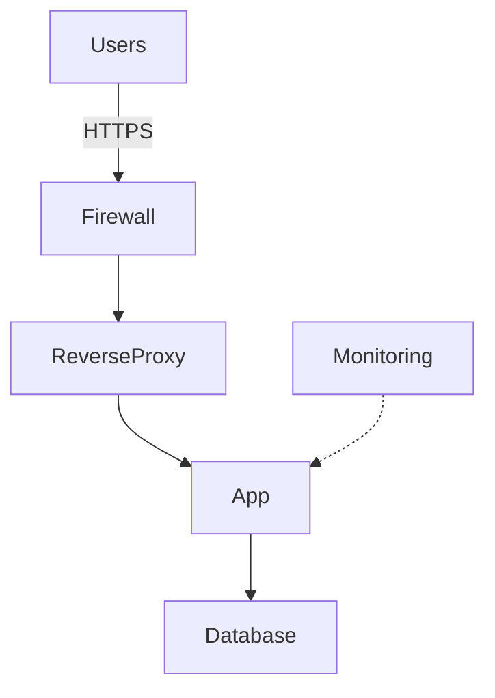

# Project Planning Tools

Generate PM-ready project artifacts from your book library.

## Quick Start

```python
# Analyze any project
analyze_project("Build a VPS on Hetzner")

# Generate essential docs
analyze_project("Build a web app", mode="quick")

# Generate everything
analyze_project("Build a data pipeline", mode="full", save_artifacts=True)
```

---

## Tools

| Tool | Purpose |
|------|---------|
| `analyze_project` | **Entry point** — analyze goal, generate artifacts |
| `generate_brd` | Business Requirements Document |
| `generate_wireframe_brief` | Architecture diagram + components |
| `generate_implementation_plan` | Phased timeline with prompts |
| `get_phase_prompts` | Actionable next steps |

---

## analyze_project

Orchestrator that analyzes your goal and generates documentation.

```python
analyze_project(goal, mode="overview")
```

**Modes:**

| Mode | Generates |
|------|-----------|
| `overview` | Analysis + recommendations only |
| `quick` | BRD + Implementation Plan |
| `full` | All artifacts (BRD, Architecture, Plan) |

**Examples:**

```python
# Assessment only
analyze_project("Build a VPS on Hetzner")

# Essential docs
analyze_project("Build a customer portal", mode="quick")

# Full package, saved to files
analyze_project(
    "Build a data pipeline",
    mode="full",
    save_artifacts=True,
    output_dir="./docs"
)
```

---

## generate_brd

Business Requirements Document with objectives, scope, requirements, and risks.

```python
generate_brd(goal, template_style="standard")
```

**Styles:**

| Style | Length |
|-------|--------|
| `lean` | ~2K chars (1-2 pages) |
| `standard` | ~7K chars (full BRD) |
| `enterprise` | ~8.5K chars (+ governance) |

---

## generate_wireframe_brief

Architecture overview with Mermaid diagram, components, and tech decisions.

```python
generate_wireframe_brief(goal, audience="stakeholder")
```

**Audiences:**

| Audience | Detail Level |
|----------|--------------|
| `executive` | High-level only |
| `stakeholder` | Balanced (default) |
| `technical` | Full tech decisions |

---

## generate_implementation_plan

Phased timeline with objectives, decisions, risks, and prompts.

```python
generate_implementation_plan(goal, team_size=1, start_date="2025-01-15")
```

**Includes:**
- Timeline visualization
- Phase breakdown with dates
- Decisions to make
- Risks and mitigations
- Actionable prompts

---

## get_phase_prompts

Actionable prompts for execution.

```python
get_phase_prompts(goal, phase_name="", prompt_type="all")
```

**Prompt Types:** `action` | `decision` | `research` | `risk`

---

## Templates

**5 Project Types:**

| Type | Phases | Days |
|------|--------|------|
| VPS / Server Infrastructure | 6 | 25 |
| Web Application | 5 | 35 |
| Data Pipeline | 5 | 22 |
| Automation / Scripting | 4 | 12 |
| MCP Server | 5 | 20 |

---

## Workflow

### Option 1: One Command

```python
analyze_project("Build a VPS", mode="full", save_artifacts=True)
```

### Option 2: Step by Step

```python
analyze_project("Build a VPS")           # Assess
generate_brd("Build a VPS")              # Requirements
generate_wireframe_brief("Build a VPS")  # Architecture
generate_implementation_plan("Build a VPS")  # Timeline
get_phase_prompts("Build a VPS")         # Next steps
```

---

## File Output

```python
analyze_project("goal", mode="full", save_artifacts=True, output_dir="./docs")
```

Creates:
- `brd.md` (~6 KB)
- `architecture.md` (~6 KB)
- `implementation-plan.md` (~12 KB)

---

## Sample Output

### Analysis

```
Project: VPS / Server Infrastructure
Complexity: Moderate (score: 39.5)
Duration: 25 days (~5 weeks)
Phases: 6 | Components: 7

Recommendations:
🔴 generate_learning_path() — Review library content
🔴 generate_brd() — Document requirements
🟡 generate_wireframe_brief() — Review architecture
🔴 generate_implementation_plan() — Create timeline
```

### Timeline

```
PHASE 1: PLANNING      ███      3d
PHASE 2: SERVER SETUP  █████    5d
PHASE 3: WEB SERVER    ████     4d
PHASE 4: DEPLOYMENT    ███████  7d
PHASE 5: MONITORING    ████     4d
PHASE 6: DOCS          ██       2d
```

### Architecture



---

## Stats

| Metric | Value |
|--------|-------|
| Tools | 8 |
| Project Templates | 5 |
| Architecture Templates | 5 |
